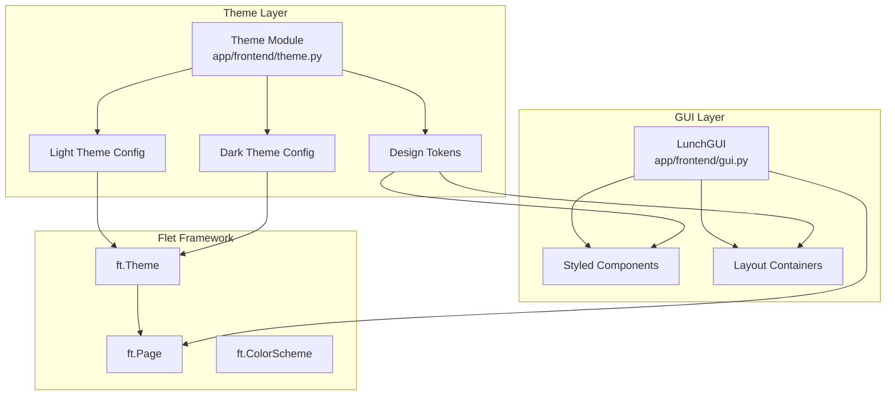

# Design Document: Basecoat UI Refactor

## Overview

This design document describes the architecture and implementation approach for refactoring the Lunch application's Flet-based frontend to adopt the Basecoat UI design language. The refactoring introduces a centralized theming system that implements Basecoat's design tokens (colors, typography, spacing, border radius) while preserving all existing functionality and maintaining cross-platform compatibility.

The implementation uses Flet's built-in theming capabilities (`ft.Theme`, `ft.ColorScheme`) to apply consistent styling across all components without requiring external CSS or additional dependencies.

### Baseline UI Reference

The current application has the following visual structure (see reference images provided):

**Main Screen (Light Theme):**
- Clean white background (#ffffff)
- Banner image at top (350px wide, dark blue with green geometric "LUNCH" text pattern)
- Instructional text: "Click below to find out what's for Lunch:" (centered, dark gray)
- Radio button group: Cheap / Normal (horizontal layout, centered, Normal selected by default)
- Four action buttons in a row: "Roll Lunch" (primary/filled), "Delete Restaurant", "Add Restaurant", "List All" (outline style)
- Result text below buttons: "Today's lunch: [Restaurant Name]" (centered)
- Buttons wrap to multiple rows on narrow viewports

**Main Screen (Dark Theme):**
- Dark gray background (#424242 or similar)
- Same layout as light theme
- White text for contrast
- Banner image unchanged (has its own dark background)

**Modal Dialogs (Bottom Sheets):**

*Add Restaurant Modal:*
- White background with rounded corners
- Title: "Add New Restaurant" (bold, larger text)
- Text field with label "Restaurant Name" (outlined input)
- "Price Range:" label
- Radio group: Cheap / Normal (vertical or horizontal layout)
- Action buttons right-aligned: "Cancel" (outline), "Add" (primary/filled)
- Modal appears centered with dimmed backdrop

*Delete Restaurant Modal:*
- White background with rounded corners
- Title: "Select Restaurant to Delete" (bold, larger text)
- Scrollable list of restaurant buttons (outline style)
- Each button shows: "Restaurant Name (Category)"
- Buttons are clickable and styled as outline buttons
- Modal appears centered with dimmed backdrop

*List All Modal:*
- White background with rounded corners
- Title: "All Restaurants" (bold, larger text)
- Scrollable list of restaurant text items
- Each item shows: "Restaurant Name (Category)"
- "Close" button at bottom (outline style)
- Modal appears centered with dimmed backdrop

**Design Observations:**
- All modals use white backgrounds regardless of theme
- Primary action buttons use filled style (Roll Lunch, Add)
- Secondary action buttons use outline style (Delete Restaurant, Add Restaurant, List All, Cancel, Close)
- Consistent spacing between elements
- Radio buttons use native Flet styling
- Text fields use outlined style with labels
- Modal titles are bold and larger than body text

## Architecture



## Components and Interfaces

### Theme Module (`app/frontend/theme.py`)

A new module responsible for defining and managing Basecoat design tokens and Flet theme configuration.

```python
# Interface
class BasecoatTheme:
    """Basecoat design token definitions and theme factory."""
    
    # Color tokens (semantic names)
    COLORS: dict[str, dict[str, str]]  # {"light": {...}, "dark": {...}}
    
    # Typography tokens
    TYPOGRAPHY: dict[str, dict[str, Any]]  # {"heading": {...}, "body": {...}, "label": {...}}
    
    # Spacing tokens (in pixels)
    SPACING: dict[str, int]  # {"xs": 4, "sm": 8, "md": 16, "lg": 24, "xl": 32}
    
    # Border radius tokens
    BORDER_RADIUS: dict[str, int]  # {"sm": 4, "md": 8, "lg": 12}
    
    @staticmethod
    def create_light_theme() -> ft.Theme:
        """Create Flet theme with Basecoat light color palette."""
        
    @staticmethod
    def create_dark_theme() -> ft.Theme:
        """Create Flet theme with Basecoat dark color palette."""
    
    @staticmethod
    def apply_theme(page: ft.Page) -> None:
        """Apply Basecoat theme to a Flet page with system theme detection."""
```

### Styled Component Factories

Helper functions to create consistently styled components:

```python
# Button factory functions
def create_primary_button(text: str, on_click: Callable) -> ft.ElevatedButton:
    """Create a Basecoat-styled primary button with filled background."""

def create_outline_button(text: str, on_click: Callable) -> ft.OutlinedButton:
    """Create a Basecoat-styled outline button with border styling."""

def create_destructive_button(text: str, on_click: Callable) -> ft.ElevatedButton:
    """Create a Basecoat-styled destructive button with destructive colors."""

# Container factory functions
def create_card_container(content: ft.Control, **kwargs) -> ft.Container:
    """Create a Basecoat-styled card container with padding and border radius."""

def create_modal_content(title: str, body: list[ft.Control], actions: list[ft.Control]) -> ft.Container:
    """Create a Basecoat-styled modal dialog content structure."""

# Input factory functions
def create_styled_textfield(label: str, **kwargs) -> ft.TextField:
    """Create a Basecoat-styled text field with border color from tokens."""
```

**Note on Theme Awareness:**
The current implementation of button and container factories uses hardcoded `LIGHT_COLORS`. For full theme support, these factories should be updated to detect the current theme mode and use appropriate colors. This can be achieved by:
1. Passing the page object to factories to check `page.theme_mode`
2. Using theme-relative color references instead of hardcoded values
3. Relying on Flet's theme system to automatically apply colors based on the active theme

For the initial implementation, we'll use the light theme colors as defaults, with the understanding that full dynamic theme switching will require additional refinement.

### Updated LunchGUI Class

The existing `LunchGUI` class will be updated to:

1. Apply the Basecoat theme on initialization
2. Use styled component factories instead of raw Flet controls
3. Reference semantic color tokens for any custom styling
4. Update modal dialogs to use the modal_content factory

```python
class LunchGUI:
    def __init__(self, page: ft.Page):
        self.page = page
        BasecoatTheme.apply_theme(page)  # NEW: Apply theme first
        self.setup_page()
        self.create_controls()
        self.setup_layout()
        # ... rest unchanged
    
    def setup_page(self):
        """Configure the main page settings."""
        self.page.title = "Lunch"
        self.page.window_width = 800
        self.page.window_height = 400
        self.page.vertical_alignment = "center"
        self.page.horizontal_alignment = "center"
        self.page.padding = SPACING["md"]
        # Background color will be set by theme
    
    def create_controls(self):
        # Banner image - no card styling, just the image
        self.banner_image = ft.Image(
            src="banner.png",
            width=350,
            fit=ft.ImageFit.CONTAIN,
        )
        
        # Action buttons using styled factories
        self.button_row = ft.Row(
            controls=[
                create_primary_button("Roll Lunch", self._on_roll_lunch_clicked),
                create_outline_button("Delete Restaurant", self._show_delete_restaurant_sheet),
                create_outline_button("Add Restaurant", self._show_add_restaurant_sheet),
                create_outline_button("List All", self._show_list_all_sheet),
            ],
            alignment=ft.MainAxisAlignment.CENTER,
            wrap=True,
            spacing=SPACING["sm"],
            run_spacing=SPACING["sm"],
        )
    
    def _show_add_restaurant_sheet(self):
        """Show add restaurant modal using modal_content factory."""
        entry_field = create_styled_textfield("Restaurant Name")
        option_radio = ft.RadioGroup(...)
        
        modal = create_modal_content(
            title="Add New Restaurant",
            body=[
                entry_field,
                ft.Text("Price Range:"),
                option_radio,
            ],
            actions=[
                create_outline_button("Cancel", self._close_bottom_sheet),
                create_primary_button("Add", add_restaurant_confirm),
            ]
        )
        # ... show modal
```

## Data Models

### Design Token Structures

```python
from dataclasses import dataclass
from typing import TypedDict

class ColorPalette(TypedDict):
    """Basecoat semantic color palette."""
    primary: str
    primary_foreground: str
    secondary: str
    secondary_foreground: str
    muted: str
    muted_foreground: str
    accent: str
    accent_foreground: str
    destructive: str
    destructive_foreground: str
    background: str
    foreground: str
    card: str
    card_foreground: str
    border: str
    input: str
    ring: str

class TypographyScale(TypedDict):
    """Typography configuration."""
    size: int
    weight: str  # "normal", "bold", "w500", etc.
    
class SpacingTokens(TypedDict):
    """Spacing values in pixels."""
    xs: int  # 4px - gap-1
    sm: int  # 8px - gap-2
    md: int  # 16px - gap-4
    lg: int  # 24px - gap-6
    xl: int  # 32px - gap-8

class BorderRadiusTokens(TypedDict):
    """Border radius values in pixels."""
    sm: int   # 4px
    md: int   # 8px
    lg: int   # 12px
    full: int # 9999px (pill shape)
```

### Implementation Notes

**Banner Image Styling:**
Based on the baseline UI, the banner image should remain as a simple `ft.Image` without card container wrapping. The image already has its own dark background and should be displayed cleanly without additional borders or padding.

**Modal Dialog Structure:**
All bottom sheet modals should use white backgrounds with rounded corners. The modal content should be structured with:
- Title at top (bold, larger text)
- Body content with consistent spacing
- Action buttons right-aligned at bottom

**Button Styling:**
- "Roll Lunch" is the primary action (filled button)
- All other action buttons use outline style
- Modal action buttons: "Cancel" uses outline, "Add" uses primary

### Basecoat Color Values

Light theme colors (derived from Basecoat UI):
```python
LIGHT_COLORS: ColorPalette = {
    "primary": "#18181b",        # zinc-900
    "primary_foreground": "#fafafa",
    "secondary": "#f4f4f5",      # zinc-100
    "secondary_foreground": "#18181b",
    "muted": "#f4f4f5",
    "muted_foreground": "#71717a",
    "accent": "#f4f4f5",
    "accent_foreground": "#18181b",
    "destructive": "#ef4444",    # red-500
    "destructive_foreground": "#fafafa",
    "background": "#ffffff",
    "foreground": "#09090b",
    "card": "#ffffff",
    "card_foreground": "#09090b",
    "border": "#e4e4e7",         # zinc-200
    "input": "#e4e4e7",
    "ring": "#18181b",
}

DARK_COLORS: ColorPalette = {
    "primary": "#fafafa",
    "primary_foreground": "#18181b",
    "secondary": "#27272a",      # zinc-800
    "secondary_foreground": "#fafafa",
    "muted": "#27272a",
    "muted_foreground": "#a1a1aa",
    "accent": "#27272a",
    "accent_foreground": "#fafafa",
    "destructive": "#dc2626",    # red-600
    "destructive_foreground": "#fafafa",
    "background": "#09090b",
    "foreground": "#fafafa",
    "card": "#09090b",
    "card_foreground": "#fafafa",
    "border": "#27272a",
    "input": "#27272a",
    "ring": "#d4d4d8",
}
```

## Testing Requirements

The implementation SHALL be validated through a combination of unit tests, integration tests, and selective property-based tests:

### Core Design Token Validation (Property-Based Tests)

These properties use Hypothesis for comprehensive validation:

**Property 1: Design Token Completeness**
- All design token categories (colors, typography, spacing, border radius) SHALL define required keys with valid, non-empty values
- **Validates: Requirements 1.1, 1.2, 1.3, 1.4**

**Property 9: Theme Mode Produces Valid Colors**
- Theme factories for both light and dark modes SHALL produce themes with all required color values as valid hex color strings
- **Validates: Requirements 6.1, 6.2**

**Property 10: Semantic Colors Resolve in Both Themes**
- All semantic color names SHALL exist in both light and dark color palettes with valid color values
- **Validates: Requirements 6.3**

### Component Styling Validation (Unit Tests)

**Button Styling:**
- Primary buttons SHALL have filled background with primary color and contrasting text
- Outline buttons SHALL have transparent background with border from theme tokens
- Destructive buttons SHALL use destructive color scheme
- **Validates: Requirements 2.1, 2.2, 2.3**

**Container Styling:**
- Card containers SHALL use padding and border_radius from design tokens
- Modal content SHALL have correct structure (header, body, footer)
- **Validates: Requirements 3.1, 3.2**

**Input Styling:**
- Text fields SHALL use border colors from theme tokens
- Focused state SHALL use ring color from theme tokens
- **Validates: Requirements 3.3**

**Layout Spacing:**
- All layouts SHALL use spacing values from SPACING tokens
- **Validates: Requirements 3.4**

### Functionality Validation (Integration Tests)

**Core Application Features:**
- Roll lunch functionality SHALL execute and display results correctly
- Add restaurant dialog SHALL persist data to database
- Delete restaurant dialog SHALL remove selected restaurant
- List all dialog SHALL display all restaurants
- Radio group selection SHALL update application state
- **Validates: Requirements 4.1, 4.2, 4.3, 4.4, 4.5**

**Theme Application:**
- GUI initialization SHALL apply Basecoat theme correctly
- Theme changes SHALL update all component colors at runtime
- **Validates: Requirements 6.1, 6.2, 6.4**

## Error Handling

### Theme Loading Errors

- If theme configuration fails to load, the application SHALL fall back to Flet's default theme
- Invalid color values SHALL be logged and replaced with sensible defaults
- Missing design tokens SHALL trigger a warning log but not crash the application

### Component Styling Errors

- If a styled component factory receives invalid parameters, it SHALL return a default-styled component
- Theme token lookups SHALL use `.get()` with fallback values to prevent KeyError exceptions

### Runtime Theme Switching

- Theme changes SHALL be wrapped in try/except to prevent UI crashes
- Failed theme switches SHALL maintain the current theme and log the error

## Testing Strategy

### Testing Approach

This implementation uses a combination of unit tests, integration tests, and selective property-based tests:

- **Unit tests**: Verify specific component behavior, styling, and configuration
- **Integration tests**: Verify end-to-end functionality and component interactions
- **Property-based tests**: Used selectively for core design token validation

### Property-Based Testing Framework

The project uses **Hypothesis** (already configured in `pyproject.toml` under test dependencies) for property-based testing where appropriate.

Property-based tests are used for:

- Design token completeness validation
- Theme mode color validity
- Semantic color resolution across themes

### Test Categories

#### Theme Module Tests (`tests/test_theme.py`)

**Property-based tests:**

- Property 1: Design token completeness - verify all token categories have required keys with valid values
- Property 9: Theme mode produces valid colors - verify theme factories produce valid hex color strings
- Property 10: Semantic color resolution - verify semantic color names exist in both light and dark palettes

**Unit tests:**

- Light theme creation returns valid `ft.Theme` object
- Dark theme creation returns valid `ft.Theme` object
- Theme application to page sets correct properties
- All design token dictionaries have required keys

#### Component Factory Tests (`tests/test_components.py`)

**Unit tests:**

- Primary button has correct bgcolor and text color from tokens
- Outline button has correct border styling and no bgcolor
- Destructive button uses destructive color scheme
- Card container has correct padding and border_radius from tokens
- Modal content has correct structure (header, body, footer)
- Styled textfield has correct border colors from tokens
- Button factories return correct Flet control types

#### GUI Integration Tests (`tests/test_gui_integration.py`)

**Integration tests:**

- GUI initialization applies Basecoat theme correctly
- Roll lunch functionality executes and displays result
- Add restaurant dialog opens, accepts input, and persists to database
- Delete restaurant dialog shows restaurants and removes selected one
- List all dialog displays all restaurants in scrollable view
- Radio group selection updates application state

**Unit tests:**

- Button row uses correct spacing from SPACING tokens
- Modal layouts use correct spacing from SPACING tokens
- Radio state management updates correctly

### Web-Based Testing Approach

Testing SHALL use the web version via `task flet:web` to enable:

- **Viewport control**: Test responsive behavior at different screen sizes
- **Button interaction**: Verify button styling and click behavior in browser context
- **Screenshot capture**: On-demand screenshots for visual regression testing

This approach allows testing of cross-platform styling consistency since the web version renders the same Flet components that run on desktop and mobile.

### Test File Structure

```
tests/
├── test_theme.py           # Theme module property and unit tests
├── test_components.py      # Component factory property and unit tests
├── test_gui_integration.py # GUI integration tests
├── test_web_visual.py      # Web-based visual/viewport tests (via task flet:web)
└── conftest.py             # Shared fixtures (mock page, theme instances)
```
