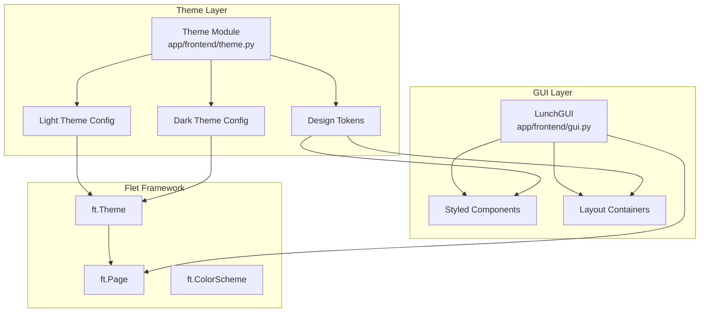

# Design Document: Basecoat UI Refactor

## Overview

This design document describes the architecture and implementation approach for refactoring the Lunch application's Flet-based frontend to adopt the Basecoat UI design language. The refactoring introduces a centralized theming system that implements Basecoat's design tokens (colors, typography, spacing, border radius) while preserving all existing functionality and maintaining cross-platform compatibility.

The implementation uses Flet's built-in theming capabilities (`ft.Theme`, `ft.ColorScheme`) to apply consistent styling across all components without requiring external CSS or additional dependencies.

## Architecture



## Components and Interfaces

### Theme Module (`app/frontend/theme.py`)

A new module responsible for defining and managing Basecoat design tokens and Flet theme configuration.

```python
# Interface
class BasecoatTheme:
    """Basecoat design token definitions and theme factory."""
    
    # Color tokens (semantic names)
    COLORS: dict[str, dict[str, str]]  # {"light": {...}, "dark": {...}}
    
    # Typography tokens
    TYPOGRAPHY: dict[str, dict[str, Any]]  # {"heading": {...}, "body": {...}, "label": {...}}
    
    # Spacing tokens (in pixels)
    SPACING: dict[str, int]  # {"xs": 4, "sm": 8, "md": 16, "lg": 24, "xl": 32}
    
    # Border radius tokens
    BORDER_RADIUS: dict[str, int]  # {"sm": 4, "md": 8, "lg": 12}
    
    @staticmethod
    def create_light_theme() -> ft.Theme:
        """Create Flet theme with Basecoat light color palette."""
        
    @staticmethod
    def create_dark_theme() -> ft.Theme:
        """Create Flet theme with Basecoat dark color palette."""
    
    @staticmethod
    def apply_theme(page: ft.Page) -> None:
        """Apply Basecoat theme to a Flet page with system theme detection."""
```

### Styled Component Factories

Helper functions to create consistently styled components:

```python
# Button factory functions
def create_primary_button(text: str, on_click: Callable) -> ft.ElevatedButton:
    """Create a Basecoat-styled primary button."""

def create_outline_button(text: str, on_click: Callable) -> ft.OutlinedButton:
    """Create a Basecoat-styled outline button."""

def create_destructive_button(text: str, on_click: Callable) -> ft.ElevatedButton:
    """Create a Basecoat-styled destructive button."""

# Container factory functions
def create_card_container(content: ft.Control, **kwargs) -> ft.Container:
    """Create a Basecoat-styled card container."""

def create_modal_content(title: str, body: list[ft.Control], actions: list[ft.Control]) -> ft.Container:
    """Create a Basecoat-styled modal dialog content structure."""
```

### Updated LunchGUI Class

The existing `LunchGUI` class will be updated to:

1. Apply the Basecoat theme on initialization
2. Use styled component factories instead of raw Flet controls
3. Reference semantic color tokens for any custom styling

```python
class LunchGUI:
    def __init__(self, page: ft.Page):
        self.page = page
        BasecoatTheme.apply_theme(page)  # NEW: Apply theme first
        self.setup_page()
        self.create_controls()
        self.setup_layout()
        # ... rest unchanged
    
    def create_controls(self):
        # Use styled factories
        self.banner_image = create_card_container(
            ft.Image(src="banner.png", width=350, fit=ft.ImageFit.CONTAIN)
        )
        
        self.button_row = ft.Row(
            controls=[
                create_primary_button("Roll Lunch", self._on_roll_lunch_clicked),
                create_outline_button("Delete Restaurant", self._show_delete_restaurant_sheet),
                create_outline_button("Add Restaurant", self._show_add_restaurant_sheet),
                create_outline_button("List All", self._show_list_all_sheet),
            ],
            # ... layout props
        )
```

## Data Models

### Design Token Structures

```python
from dataclasses import dataclass
from typing import TypedDict

class ColorPalette(TypedDict):
    """Basecoat semantic color palette."""
    primary: str
    primary_foreground: str
    secondary: str
    secondary_foreground: str
    muted: str
    muted_foreground: str
    accent: str
    accent_foreground: str
    destructive: str
    destructive_foreground: str
    background: str
    foreground: str
    card: str
    card_foreground: str
    border: str
    input: str
    ring: str

class TypographyScale(TypedDict):
    """Typography configuration."""
    size: int
    weight: str  # "normal", "bold", "w500", etc.
    
class SpacingTokens(TypedDict):
    """Spacing values in pixels."""
    xs: int  # 4px - gap-1
    sm: int  # 8px - gap-2
    md: int  # 16px - gap-4
    lg: int  # 24px - gap-6
    xl: int  # 32px - gap-8

class BorderRadiusTokens(TypedDict):
    """Border radius values in pixels."""
    sm: int   # 4px
    md: int   # 8px
    lg: int   # 12px
    full: int # 9999px (pill shape)
```

### Basecoat Color Values

Light theme colors (derived from Basecoat UI):
```python
LIGHT_COLORS: ColorPalette = {
    "primary": "#18181b",        # zinc-900
    "primary_foreground": "#fafafa",
    "secondary": "#f4f4f5",      # zinc-100
    "secondary_foreground": "#18181b",
    "muted": "#f4f4f5",
    "muted_foreground": "#71717a",
    "accent": "#f4f4f5",
    "accent_foreground": "#18181b",
    "destructive": "#ef4444",    # red-500
    "destructive_foreground": "#fafafa",
    "background": "#ffffff",
    "foreground": "#09090b",
    "card": "#ffffff",
    "card_foreground": "#09090b",
    "border": "#e4e4e7",         # zinc-200
    "input": "#e4e4e7",
    "ring": "#18181b",
}

DARK_COLORS: ColorPalette = {
    "primary": "#fafafa",
    "primary_foreground": "#18181b",
    "secondary": "#27272a",      # zinc-800
    "secondary_foreground": "#fafafa",
    "muted": "#27272a",
    "muted_foreground": "#a1a1aa",
    "accent": "#27272a",
    "accent_foreground": "#fafafa",
    "destructive": "#dc2626",    # red-600
    "destructive_foreground": "#fafafa",
    "background": "#09090b",
    "foreground": "#fafafa",
    "card": "#09090b",
    "card_foreground": "#fafafa",
    "border": "#27272a",
    "input": "#27272a",
    "ring": "#d4d4d8",
}
```

## Correctness Properties

*A property is a characteristic or behavior that should hold true across all valid executions of a system-essentially, a formal statement about what the system should do. Properties serve as the bridge between human-readable specifications and machine-verifiable correctness guarantees.*

Based on the prework analysis, the following properties have been identified and consolidated to eliminate redundancy:

### Property 1: Design Token Completeness

*For any* design token category (colors, typography, spacing, border radius), the theme module SHALL define all required keys with valid, non-empty values.

**Validates: Requirements 1.1, 1.2, 1.3, 1.4**

### Property 2: Primary Button Styling

*For any* primary button created via the button factory, the button SHALL have a filled background color matching the theme's primary color and contrasting foreground text.

**Validates: Requirements 2.1**

### Property 3: Outline Button Styling

*For any* outline button created via the button factory, the button SHALL have a transparent or no background and a border color derived from the theme's border token.

**Validates: Requirements 2.2**

### Property 4: Destructive Button Styling

*For any* destructive button created via the button factory, the button SHALL use the theme's destructive color for its primary visual element.

**Validates: Requirements 2.3**

### Property 5: Container Styling with Theme Tokens

*For any* card container or modal content created via the container factories, the container SHALL have padding and border_radius values that match the theme's spacing and border radius tokens.

**Validates: Requirements 3.1, 3.2**

### Property 6: Input Styling with Theme Tokens

*For any* form input (TextField) styled with the theme, the input SHALL have border color matching the theme's input or border token.

**Validates: Requirements 3.3**

### Property 7: Layout Spacing Uses Tokens

*For any* Row or Column layout with spacing applied, the spacing value SHALL be one of the defined spacing token values (xs, sm, md, lg, xl).

**Validates: Requirements 3.4**

### Property 8: Radio State Management

*For any* radio group selection change, the GUI's current_option state SHALL be updated to match the selected radio value.

**Validates: Requirements 4.5**

### Property 9: Theme Mode Produces Valid Colors

*For any* theme mode (light or dark), the theme factory SHALL produce a theme with all required color values as valid hex color strings.

**Validates: Requirements 6.1, 6.2**

### Property 10: Semantic Colors Resolve in Both Themes

*For any* semantic color name used in the application, both the light and dark color palettes SHALL contain a valid color value for that name.

**Validates: Requirements 6.3**

## Error Handling

### Theme Loading Errors

- If theme configuration fails to load, the application SHALL fall back to Flet's default theme
- Invalid color values SHALL be logged and replaced with sensible defaults
- Missing design tokens SHALL trigger a warning log but not crash the application

### Component Styling Errors

- If a styled component factory receives invalid parameters, it SHALL return a default-styled component
- Theme token lookups SHALL use `.get()` with fallback values to prevent KeyError exceptions

### Runtime Theme Switching

- Theme changes SHALL be wrapped in try/except to prevent UI crashes
- Failed theme switches SHALL maintain the current theme and log the error

## Testing Strategy

### Dual Testing Approach

This implementation uses both unit tests and property-based tests:

- **Unit tests**: Verify specific examples, edge cases, and integration points
- **Property-based tests**: Verify universal properties that should hold across all inputs

### Property-Based Testing Framework

The project uses **Hypothesis** (already configured in `pyproject.toml` under test dependencies) for property-based testing.

Each property-based test MUST:

1. Run a minimum of 100 iterations
2. Be tagged with a comment referencing the correctness property: `**Feature: basecoat-ui-refactor, Property {number}: {property_text}**`
3. Use smart generators that constrain to valid input spaces

### Test Categories

#### Theme Module Tests (`tests/test_theme.py`)

**Property-based tests:**

- Property 1: Design token completeness - generate random token category, verify all keys present with valid values
- Property 9: Theme mode produces valid colors - generate theme mode, verify all colors are valid hex strings
- Property 10: Semantic color resolution - generate semantic color name, verify both palettes have values

**Unit tests:**

- Light theme creation returns valid `ft.Theme` object
- Dark theme creation returns valid `ft.Theme` object
- Theme application to page sets correct properties

#### Component Factory Tests (`tests/test_components.py`)

**Property-based tests:**

- Property 2: Primary button styling - generate button text/callbacks, verify styling
- Property 3: Outline button styling - generate button text/callbacks, verify styling
- Property 4: Destructive button styling - generate button text/callbacks, verify styling
- Property 5: Container styling - generate content, verify padding/border_radius from tokens
- Property 6: Input styling - generate input configs, verify border color from tokens

**Unit tests:**

- Button factories return correct Flet control types
- Container factories apply expected structure

#### GUI Integration Tests (`tests/test_gui_integration.py`)

**Property-based tests:**

- Property 7: Layout spacing - generate layout configurations, verify spacing values are from tokens
- Property 8: Radio state management - generate radio values, verify state updates correctly

**Unit tests:**

- GUI initialization applies theme
- All existing functionality callbacks work correctly (roll, add, delete, list)

### Web-Based Testing Approach

Testing SHALL use the web version via `task flet:web` to enable:

- **Viewport control**: Test responsive behavior at different screen sizes
- **Button interaction**: Verify button styling and click behavior in browser context
- **Screenshot capture**: On-demand screenshots for visual regression testing

This approach allows testing of cross-platform styling consistency since the web version renders the same Flet components that run on desktop and mobile.

### Test File Structure

```
tests/
├── test_theme.py           # Theme module property and unit tests
├── test_components.py      # Component factory property and unit tests
├── test_gui_integration.py # GUI integration tests
├── test_web_visual.py      # Web-based visual/viewport tests (via task flet:web)
└── conftest.py             # Shared fixtures (mock page, theme instances)
```
